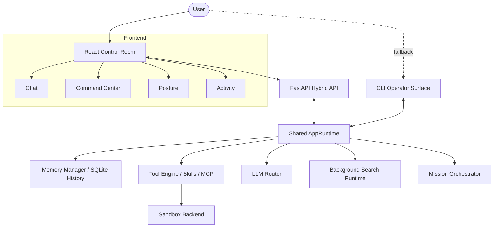

# Zephyr

Zephyr is a local-first AI sidekick with a primary React control room backed by a FastAPI bridge over the shared Python runtime. The browser UI is the default interface now; the CLI remains available as the explicit fallback/operator surface.

## Current Surfaces

- Primary interface: `run.bat` or `run-hybrid.bat`, which start the React control room and FastAPI backend together.
- Fallback interface: `run-cli.bat`, which starts the terminal CLI on the same shared runtime stack.
- Shared runtime: `core/app_runtime.py`, reused by the CLI, backend services, and verification workflows.
- Backend bridge: `backend/api/routes/`, which exposes status, runtime, sessions, chat, missions, and command-center inspection.
- Frontend views: `Chat`, `Command Center`, `Posture`, and `Activity`.

## System Architecture



## Current Features

- Streaming chat over Server-Sent Events through `/api/chat/stream`.
- Streaming mission progress through `/api/missions/stream`.
- Progressive runtime reload and prepare activity through `/api/runtime/reload/stream` and `/api/runtime/prepare/stream`.
- Session restore from browser `sessionStorage` plus persisted message history through `/api/sessions`.
- Browser-native command-center coverage for `/skills`, `/memory`, `/mcp`, `/verify`, `/help`, `/reload`, `/prepare`, `/session`, and `/mission`.
- Privacy posture and runtime trust visibility surfaced in the `Posture` view.
- Startup guidance, runtime metrics, execution mode, and preparation output surfaced in the `Activity` view.
- Browser confirmation for sensitive tool usage when `REQUIRE_CONFIRMATION=true`.
- Shared runtime preparation for sandbox assets, embedding-model cache, and provider-specific local assets.
- Optional MCP and Claude-Mem subprocess integrations when enabled in the environment.

## Project Layout

```text
Zephyr/
├── backend/                  FastAPI bridge, schemas, and backend services
├── frontend/                 React + Vite control room
├── core/                     Shared runtime, orchestration, memory, search, and tooling
├── skills/                   Built-in and dynamic skill packages
├── knowledge/                Durable memory and persona assets
├── data/                     Scenarios, SQLite DB, keyword index, and vector store
├── config.py                 Central runtime configuration
├── main.py                   CLI entry point
├── setup.bat                 Interactive setup flow
├── run.bat                   Primary launcher
├── run-hybrid.bat            Explicit hybrid launcher
├── run-cli.bat               CLI fallback launcher
├── verify_command_center_inventory.py
└── verify_hybrid_workflow.py
```

## Quick Start

Prerequisites:

- Python 3.11+
- Node.js 18+ with npm for the primary React interface
- One configured inference backend such as Ollama, OpenRouter, or LlamaCPP

Recommended setup:

```bat
setup.bat
run.bat
```

`setup.bat` creates or reuses `venv`, installs Python dependencies, installs frontend dependencies when npm is available, and can generate `.env` interactively.

Manual setup:

```bat
python -m venv venv
venv\Scripts\activate
pip install -r requirements.txt
npm run install:frontend
copy .env.example .env
```

After copying `.env.example`, set your provider and provider-specific settings, then start the primary interface:

```bat
run.bat
```

`run.bat` delegates to `run-hybrid.bat`, which starts FastAPI on `http://127.0.0.1:8000` and React on `http://127.0.0.1:5173`.

To start the CLI fallback instead:

```bat
run-cli.bat
```

If startup guidance reports missing local assets, use the `Prepare Runtime` action in the `Activity` view or run `/prepare` in the CLI.

## Development And Verification

- `npm run dev:hybrid`: watcher-driven hybrid development using `python -m backend.dev_server` plus Vite.
- `npm run dev:hybrid:stable`: stable no-reload backend plus Vite.
- `npm run verify:command-center`: focused regression check for command-center inventory stability.
- `npm run verify:hybrid`: frontend build plus launcher wiring, watcher-driven launch smoke, stable launch smoke, command-center inventory regression, runtime action stream regression, and mission stream regression.

## API Surface

- `GET /api/system/health`
- `GET /api/system/status`
- `POST /api/runtime/reload`
- `POST /api/runtime/reload/stream`
- `POST /api/runtime/prepare`
- `POST /api/runtime/prepare/stream`
- `POST /api/sessions`
- `GET /api/sessions/{session_id}/messages`
- `POST /api/chat/turn`
- `POST /api/chat/stream`
- `POST /api/missions/turn`
- `POST /api/missions/stream`
- `GET /api/command-center/overview`
- `POST /api/command-center/mcp/apply`
- `POST /api/command-center/mcp/refresh`
- `POST /api/command-center/verify`

The full documentation set now lives under `Docs/`, and `Docs/DASHBOARD.md` maps those endpoints onto the current React control room.

## Configuration

The repository includes `.env.example` with the main runtime settings. The most important switches are:

- `LLM_PROVIDER` to choose `ollama`, `openrouter`, or `llamacpp`
- provider-specific model and connection settings
- `REQUIRE_CONFIRMATION` to require browser confirmation before sensitive tool use in chat or mission requests
- `MCP_ENABLED` and `EXTERNAL_SUBPROCESS_INTEGRATIONS_ENABLED` for external tool loading
- `SEARCH_DIR`, `SANDBOX_BACKEND`, and embedding-model settings for local runtime behavior

### MCP Configuration

MCP server tools are opt-in. A server only becomes active when all of the following are true:

- `MCP_ENABLED=true`
- `EXTERNAL_SUBPROCESS_INTEGRATIONS_ENABLED=true`
- at least one MCP server resolves to a non-empty command

The runtime supports three MCP configuration styles:

- `MCP_SERVERS_JSON` with a JSON array of server objects
- single-server variables such as `MCP_SERVER_COMMAND`
- indexed server variables such as `MCP_SERVER_1_COMMAND`, `MCP_SERVER_2_COMMAND`, and so on

Supported per-server fields are:

- `name`
- `command`
- `args`
- `env` or `env_json`
- `cwd`
- `tool_prefix`
- `connect_timeout_seconds`
- `discovery_timeout_seconds`
- `tool_timeout_seconds`
- `max_retries`
- `retry_backoff_seconds`

Example `.env` fragment:

```env
MCP_ENABLED=true
EXTERNAL_SUBPROCESS_INTEGRATIONS_ENABLED=true
MCP_SERVERS_JSON=[{"name":"archive","command":"python","args":["-m","archive_mcp"],"tool_prefix":"mcp","connect_timeout_seconds":10,"discovery_timeout_seconds":15,"tool_timeout_seconds":30,"max_retries":2,"retry_backoff_seconds":0.5}]
```

### MCP Operations And Troubleshooting

- Use the `Guided MCP Setup` block in the web `Command Center` when you want the browser to build, save, and apply `.env` configuration for one or more MCP servers. Remote MCP URLs are translated into the stdio launcher format the runtime already supports.
- Use `/mcp` in the CLI or the `Command Center` MCP panel in the web app to inspect server state, cached tool inventory, discovery freshness, last successful connection time, degraded reason, and the latest MCP execution results.
- The Command Center walkthrough can save either single-server keys, indexed `MCP_SERVER_1_*` keys, or `MCP_SERVERS_JSON`, then refresh the live MCP runtime without a full process restart.
- Use `/mcp refresh` in the CLI or `Refresh MCP` in the web `Command Center` to re-run MCP discovery without reloading the full runtime or local skill catalog.
- If a refresh fails after a previous successful discovery, the runtime keeps showing the last successful cached inventory while surfacing the current error state. This keeps operator visibility stable, but the cached tool list is not proof that the server is currently healthy.
- If MCP servers do not appear at all, check `MCP_ENABLED`, `EXTERNAL_SUBPROCESS_INTEGRATIONS_ENABLED`, and the resolved command path first. Packaged mode intentionally defaults external subprocess integrations off.
- If a server stays in `error`, inspect the reported `last_error_kind`, `last_error_tool_name`, and recent MCP result history to decide whether the issue is configuration, transport, or tool execution.
- If discovery or execution is timing out, tune `MCP_SERVER_CONNECT_TIMEOUT_SECONDS`, `MCP_SERVER_DISCOVERY_TIMEOUT_SECONDS`, `MCP_SERVER_TOOL_TIMEOUT_SECONDS`, `MCP_SERVER_MAX_RETRIES`, and `MCP_SERVER_RETRY_BACKOFF_SECONDS`, or the indexed equivalents for a specific server.
- If a server refresh fails but the underlying tool becomes healthy again, the next successful discovery refresh or tool call will restore normal ready/connected behavior without requiring a full app restart.

## Adding New Skills

Zephyr is built for extensibility.

1. Create a new directory in `skills/` such as `skills/my-new-skill/`.
2. Implement the skill logic in a Python module.
3. Reload the runtime with `/reload` in the CLI or `Reload tools` in the web interface.

See `Docs/CONTRIBUTING.md` for the contribution workflow.

## Runtime-Generated Files

Some files and directories are created locally at runtime and are intentionally ignored by git, including:

- `.env`
- `data/zephyr.db`
- `data/vector_store/`
- `data/keyword_index/`
- `logs/`
- `backups/`
- `temp_core/`
- `knowledge/memories.md`
- `knowledge/brain/timeline.log`
- `knowledge/brain/truth.md`
- `knowledge/brain/entities/`
- downloaded local model assets under `LLM/`

## Related Docs

- `Docs/README.md` for the centralized documentation index
- `Docs/glossary.md` for shared runtime and product terminology
- `Docs/HYBRID_MIGRATION_STATUS.md` for the migration and parity record
- `Docs/DASHBOARD.md` for the current control-room map

## Notes

- Archive and MCP integrations are optional and stay disabled unless configured.
- Sandbox verification can use Docker when available, or a process-isolated fallback when Docker is unavailable.
- The web interface uses router-managed browser paths such as `/chat` and `/command-center`.
